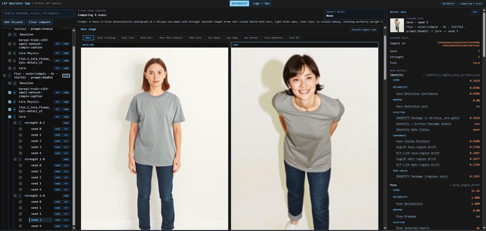
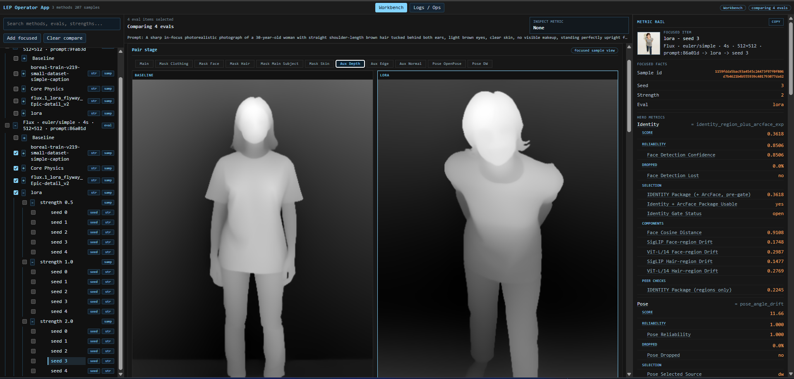
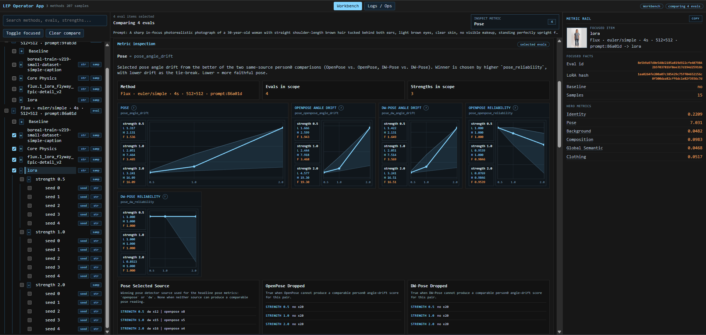

# LoRA Evaluation Project



_Baseline vs LoRA output comparison in the Operator App._

LoRA Evaluation Project is a local system for comparing LoRAs in a way that can still be inspected later. In image-generation workflows, a LoRA is a small add-on file that expands a base model's capabilities toward a specific concept, usually to cover something the base model is weak at or to make it match a very specific reference. Evaluating what a LoRA actually does is usually messy: generate a few seeds, eyeball the images, guess what the LoRA changed, try to tell whether it also bled into things it was not meant to change, and still end up unsure. This repo stores generated assets and sample measurements in a database, compares them against baselines and one another, and outputs graphs and scores for the different aspects the LoRA influenced during image generation, so you can read from measured, observable facts instead of relying on vibes.

## What It Does

The repo provides the structure needed to record, store, and review LoRA influence across controlled runs:

- **ComfyUI nodes** ingest data that is hashed and validated before storage.
- **A database** keeps records persistent, organized, and reusable.
- **A browser app** provides a central interface for reviewing runs and comparisons.
- **CLI tools** handle record management, JSON export, batch automation, and other system operations.

## Who This Is For

- **People studying LoRA behavior** to answer specific questions.
- **LoRA authors** who want to ensure quality and control bias bleed.
- **Tool developers** who would rather start from a launchpad than from a blank repo.
- **Power users who are comfortable changing code** and willing to inspect, adjust, and operate a local system.

Meaningful use assumes you bring your own question, LoRAs, and workflows. Using the project as is may still require changing workflows, metrics, procedures, or code to get the answers you actually want.

## What Gets Stored

The default stored record includes multiple evidence surfaces:

- **Image and luminance** for visible output and brightness structure.
- **Masks** for face, hair, clothing, skin, and main-subject regions.
- **SigLIP and ViT-L / 14** embeddings and patch pools for semantic drift.
- **Face analysis** for detection confidence, embeddings, pose, and keypoints.
- **Pose evidence** from structured grouped keypoints.
- **Depth, normal, and edge maps** for structural change.

It also stores the generation context needed to understand how those measurements were produced:

- **The model stack used**, such as the base model and VAE.
- **The generation settings**, such as conditioning, steps, sampler, scheduler, denoise, CFG, seed, strength, and related integrity hashes.
- **LoRA details**, such as the tensor hash, rank, targeted blocks, and metadata.
- **The workflow itself**, stored as a reusable template so more samples can be generated later under the same setup.

You can change how these records are used and combined later without altering the ingested records. The database stores observed facts only; review is assembled later from those stored records.
No noise is introduced by the measurement process itself: under the same conditions, two identical LoRAs produce the same measurements.


_Depth evidence view for structural comparison._

## What Review Can Answer

"This LoRA is good" depends on the question, the goal, and the interpretation being applied. This repo ships with a provisional package of scoring procedures, but users are expected to edit the review-assembly rules to match their own goals. You can define as many scoring rules as you want, and the app will show their results side by side. These scores can then be compared across samples produced by different LoRAs and workflows.


_Metric inspection view with score details and support facts._

## How It Works

At a high level, one run moves through:
```text
ComfyUI run -> measurement -> validation -> storage -> review assembly -> Operator App
```
That separation matters both for data integrity and for the modular nature of the codebase.

- **One run becomes one stored record**, including the output, extracted evidence, LoRA details, and the generation context behind it. 
- **Records follow an experiment structure**: a `method` defines the shared setup, and an `eval` defines the baseline or LoRA being tested within it.
- **Samples capture individual runs**: variables such as strength and seed distinguish controlled differences between runs.
- **Review is assembled later**, rather than baked into the stored record, so the same evidence can be compared, rescored, and interpreted in more than one way. 
- **The Operator App keeps the important pieces together**, so the visible pair, the metrics, the support behind them, and the run context can all be inspected at the same time.
- **The codebase stays modular**, with dedicated interfaces between major parts, so changes stay localized and easier to reason about.

## Developer Notes

This project started from a practical question around how to evaluate LoRAs in a consistent and meaningful way. Building it led to a clear answer, and once that question was resolved, it made sense to release the system as open source in its current form. It can still answer other questions, and it can still branch into many different tools.

This repo reflects the local environment it was built and used in. It works as provided on my machine, but other setups may require adjustment. I am not maintaining it as a broadly supported project and I am not looking to review pull requests.

If you have questions or want to reach out, you can contact me here:  
https://github.com/Gyropilot2

## Setup And Launch

This repo is meant to live inside `ComfyUI\custom_nodes`.

To use it as intended, you will need:

- **Windows and PowerShell** for the provided launchers and command examples.
- **Python 3.11 or newer** for the backend, CLI, and project scripts.
- **Node.js and npm** for the frontend.
- **A local ComfyUI setup**, with this repo cloned into `custom_nodes`.
- **The models, LoRAs, and workflow assets** you want to use.
- **Any custom node packs** those workflows depend on.
- **InsightFace with a compatible face-analysis pack** for the full face-aware review path. The current resolver prefers `antelopev2`, falls back to `buffalo_l`, and otherwise uses the first available pack.

For the shortest path from GitHub to a working local copy, open a terminal in your `custom_nodes` folder, clone the repo there, and install the dependencies from the repo root:

```powershell
cd StabilityMatrix\Data\Packages\ComfyUI\custom_nodes
git clone https://github.com/Gyropilot2/lora-evaluation-project.git
cd lora-evaluation-project
python -m pip install -r requirements.txt
python -m pip install -r operator_app/backend/requirements.txt
cd operator_app/frontend
npm install
cd ../..
```

To open the app after that, open `operator_app\start_operator_app.bat` in File Explorer and run it.

For the full operating instructions, start with [USER_MANUAL.md](USER_MANUAL.md). If you want the deeper technical material after that, browse the files in [.docs/](.docs/).
